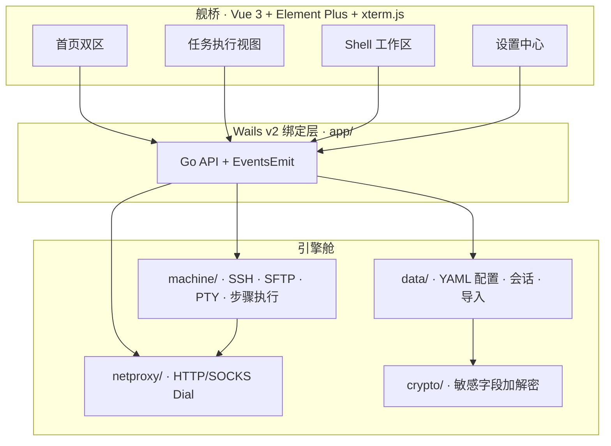

<p align="center">
  
</p>

<h1 align="center">FlashShell</h1>
<h3 align="center">多会话 SSH / SFTP 桌面终端</h3>

<p align="center">
  <strong>YAML 驱动任务流水线 × 多会话 SSH / SFTP 终端 × 本地 Shell</strong><br/>
  把构建、发布、联调、登舰运维收进<strong>同一个桌面港</strong>——任务与 Shell 并行，互不抢舵。
</p>

<p align="center">
  <a href="https://github.com/ZengLiangl/first-cmd/releases"></a>
  <a href="#平台支持"></a>
  <a href="#技术架构"></a>
  <a href="#技术架构"></a>
  <a href="LICENSE"></a>
</p>

<p align="center">
  <a href="USAGE.md"><b>📖 完整使用手册</b></a>
  &nbsp;·&nbsp;
  <a href="#快速启航">⚡ 快速启航</a>
  &nbsp;·&nbsp;
  <a href="#核心能力">🧭 核心能力</a>
  &nbsp;·&nbsp;
  <a href="https://github.com/ZengLiangl/first-cmd/releases">⬇️ 下载安装包</a>
</p>

---

```text
                         ╔════════════════ FlashShell ════════════════╗
                         ║                                           ║
    config.yaml ────────►║   任务模式          Shell 模式            ║◄──── SSH / SFTP / PTY
    本地 & 远程混排       ║   一键流水线        多 Tab · 分屏 · 广播    ║      本机终端
                         ║   实时 ANSI 日志    SFTP · 监控 · 隧道      ║
                         ║                                           ║
                         ╚══════════════════ 同港出海 ═════════════════╝
```

## FlashShell 是什么

**FlashShell** 是一款跨平台桌面 Shell 工作台。多会话 SSH / SFTP 是主业，YAML 任务流水线是边上的一键脚本：

| | 传统做法 | FlashShell |
|:--|:--|:--|
| 发布脚本 | 散落各处的 shell / bat | **YAML 编排**，图形化一键执行 |
| 远程运维 | 另开 Xshell / iTerm | **内置多会话 Shell**，Tab / 分屏 / 广播 |
| 文件传输 | 再开一个 SFTP 客户端 | **任务 upload** + Shell 侧 SFTP 面板 |
| 配置管理 | 环境变量靠记忆 | **全局变量表** + `${KEY}` 自动替换 |
| 任务与终端 | 二选一，来回切窗口 | **并行不互斥**，左跑任务右登舰 |

> 远程会话、分屏、广播、SFTP 和隧道都在同一个窗口里；任务流水线需要时再开。

---

## 核心能力

<table>
<tr>
<td width="50%" valign="top">

### 🚀 任务模式

- **Project → SubProject → Command → Step** 四级编排
- 本地 `batch` 与远程 `remote` 步骤**自由混排**
- 步骤级 **retry / on_fail** 失败策略
- `${ENV}` 全局变量替换，支持 GUI 配置编辑器
- 实时进度、本地任务可中断、ANSI 输出回传
- 内置 `upload` / `targz` / `chdir` 远程特殊命令

</td>
<td width="50%" valign="top">

### 🖥️ Shell 模式

- 多 Tab **SSH + 本机 PTY** 终端并行
- **分屏**（最多 4 窗格）、**广播**一键群发命令
- 交互式 **xterm.js**：搜索、粘底跟随、右键菜单
- 底部 **SFTP** 文件面板 + 机器监控侧栏
- **SSH 隧道**（本地转发 / 动态 SOCKS）
- 连接历史、连接管理器、**Xshell / FinalShell** 导入

</td>
</tr>
<tr>
<td width="50%" valign="top">

### 🎛️ 体验与掌控

- 任务与 Shell **v-show 并行**，切换视图不断会话
- 亮 / 暗 / 跟随系统主题，终端配色预设可定制
- 平台快捷键（⌘ / Ctrl）**可录制、可重置**
- 多窗口、Shell 内存节省模式、日志高亮规则
- 应用内**检查更新** / 下载安装包

</td>
<td width="50%" valign="top">

### 🔐 安全与基建

- SSH 密钥 / 密码**加密落盘**，列表不以明文展示
- **Host Key 信任**管理（`known_hosts.json` + 指纹确认）
- 业务 YAML 与 `~/.flashshell/` 全局配置**双层分离**
- HTTP / SOCKS **代理**贯通 SSH、SFTP 与更新请求
- 机器分组、全局账号模板、环境变量中心

</td>
</tr>
</table>

---

## 技术架构



| 层 | 技术选型 | 职责 |
|:---|:---|:---|
| 桌面壳 | **Go 1.23+** · [Wails v2](https://wails.io) | 原生窗口、系统 API、Go 并发 |
| 舰桥 UI | **Vue 3** · Element Plus · Vite · **xterm.js** | 任务 / Shell 双模式界面 |
| 执行引擎 | SSH · SFTP · PTY · `cmds/` | 本地命令、远程步骤、文件传输 |
| 数据层 | YAML · `~/.flashshell/` | 业务配置、机器、主题、快捷键 |

---

## 平台支持

| 平台 | 状态 | 构建产物 |
|:---|:---:|:---|
| Windows | ✅ | `FlashShell.exe` / NSIS 安装包 |
| macOS | ✅ | `FlashShell.app` |
| Linux | ✅ | `FlashShell` 可执行文件 |

打 tag 发布时，GitHub Actions 自动构建多平台产物，命名格式：`FlashShell-<tag>-<os>-<arch>.*`

---

## 快速启航

### 用户：直接下载

前往 [Releases](https://github.com/ZengLiangl/first-cmd/releases) 下载对应平台安装包，解压即用。首次启动若当前目录无 `config.yaml`，会自动生成示例业务配置。

### 开发者：本地构建

**环境要求：** Go `1.23+` · Node.js `16+`（推荐 20）· [Wails CLI v2](https://wails.io/docs/gettingstarted/installation)

```bash
# 安装 Wails CLI
go install github.com/wailsapp/wails/v2/cmd/wails@latest

# 克隆 & 依赖
git clone https://github.com/ZengLiangl/first-cmd.git
cd first-cmd
cd frontend && npm install && cd ..
go mod tidy

# 开发（热重载）/ 发布构建
wails dev
wails build
```

构建产物位于 `build/bin/`（macOS 为 `FlashShell.app`）。

### 全局数据目录

```text
~/.flashshell/
├── global_config.yaml    # 机器、主题、代理、环境变量…
├── shortcuts.json        # 快捷键绑定
├── shell_history.json    # Shell 连接历史
└── known_hosts.json      # SSH Host Key 信任库
```

---

## 配置体系

FlashShell 采用**业务与全局双层配置**，职责清晰、互不覆盖：

| 配置 | 路径 | 作用 |
|:---|:---|:---|
| 业务配置 | `config.yaml`（可多文件切换） | 项目、子项目、命令流水线 |
| 全局配置 | `~/.flashshell/global_config.yaml` | 窗口、机器清单、主题、代理、`workPaths` |
| 快捷键 | `~/.flashshell/shortcuts.json` | 系统级快捷键自定义 |

业务配置中的 `${KEY}` 由全局 `workPaths` 环境变量表替换。全局配置**仅在文件不存在时写入默认值**，不会覆盖已有内容。

详细操作说明见 **[USAGE.md](USAGE.md)**。

---

## 项目结构

```text
first-cmd/
├── app/              # Wails 绑定：菜单、事件、API 编排
├── data/             # 配置读写、会话、快捷键、会话导入
├── define/           # 领域类型与跨包契约
├── machine/          # 本地命令、SSH、SFTP、PTY、步骤执行
├── cmds/             # 远程特殊命令（upload、targz、chdir）
├── netproxy/         # HTTP/SOCKS 代理与统一 Dial
├── crypto/           # 敏感信息加解密
├── frontend/         # Vue 3 舰桥 UI（wailsjs/ 为生成绑定）
└── main.go           # Wails 启动入口
```

---

## 典型航线

```text
  ① 机器入港          ② 变量就绪          ③ YAML 编排          ④ 出航
  系统设置添加服务器  →  配置 WORKSPACE 等  →  编辑 config.yaml  →  任务一键执行 / Shell 登舰
```

1. **系统设置 → 机器配置**：添加服务器，测试连接，可选导入 Xshell / FinalShell
2. **环境变量**：配置 `WORKSPACE`、`PROJECT_ROOT` 等工作路径
3. **业务配置**：定义 Project / SubProject / Command 流水线
4. **首页**：进入**任务模式**执行流水线，或进入 **Shell 模式**交互运维
5. **快捷键**：按习惯改绑，保存即生效

---

## 常用命令

```bash
wails dev                          # 开发模式（热重载）
wails build                        # 发布构建
go test ./...                      # 运行测试
go fmt ./... && go vet ./...       # 格式化 & 静态检查
```

### 运行参数

| 参数 | 说明 |
|:---|:---|
| `-reg=desk` | 前台运行（默认） |
| `-reg=back` | 后台守护进程 |

后台模式日志：`/tmp/FlashShell.out`、`/tmp/FlashShell.err`。

---

## 故障排除

| 现象 | 排查建议 |
|:---|:---|
| Wails 构建失败 | 更新 Wails CLI；确认 Go / Node 版本满足要求 |
| SSH 连接失败 | 设置中心「测试连接」；检查密钥权限（`chmod 600`）与网络 |
| 全局配置被改写 | 用户数据在 `~/.flashshell/global_config.yaml`，非业务 `config.yaml` |
| 配置不生效 | 顶部配置文件菜单 → 刷新；或切换配置文件后重载 |
| 快捷键不生效 | 系统设置 → 快捷键保存后重试；输入框聚焦时默认不抢快捷键 |
| 代理不生效 | 系统设置 → HTTP 代理 → 启用手动模式并测试连通性 |

更多场景见 [USAGE.md · 故障排除](USAGE.md#故障排除)。

---

## 许可证

[MIT License](LICENSE) — 自由使用、修改与分发。

---

<p align="center">
  <sub><b>FlashShell</b> — 把会话留在一个窗口里，把时间留给真正要敲的命令。</sub>
</p>
