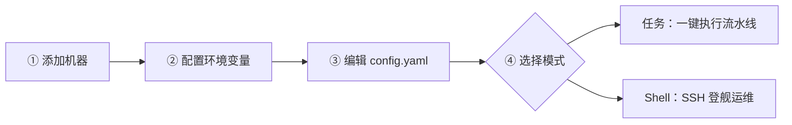
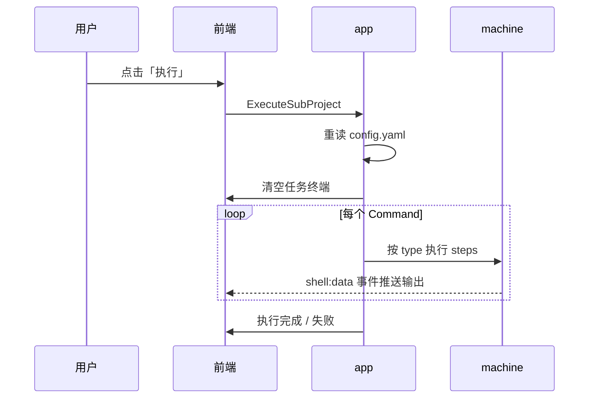

# FlashDock 使用手册

> **闪舵**完整操作指南 — 从安装到高阶玩法，与当前代码行为对齐。  
> 项目概览与架构见 [README.md](README.md)。

<p align="center">
  <a href="#五分钟上手">五分钟上手</a>
  &nbsp;·&nbsp;
  <a href="#任务模式">任务模式</a>
  &nbsp;·&nbsp;
  <a href="#shell-模式">Shell 模式</a>
  &nbsp;·&nbsp;
  <a href="#系统设置中心">系统设置</a>
  &nbsp;·&nbsp;
  <a href="#配置示例">配置示例</a>
</p>

---

## 目录

- [安装与启动](#安装与启动)
- [五分钟上手](#五分钟上手)
- [配置体系](#配置体系)
- [界面总览](#界面总览)
- [任务模式](#任务模式)
- [Shell 模式](#shell-模式)
- [系统设置中心](#系统设置中心)
- [执行模型](#执行模型)
- [命令类型与特殊命令](#命令类型与特殊命令)
- [远程机器与敏感信息](#远程机器与敏感信息)
- [环境变量与路径](#环境变量与路径)
- [键盘快捷键](#键盘快捷键)
- [故障排除](#故障排除)
- [配置示例](#配置示例)

---

## 安装与启动

### 下载安装（推荐）

1. 打开 [GitHub Releases](https://github.com/ZengLiangl/first-cmd/releases)
2. 下载对应平台的安装包或压缩包
3. 安装 / 解压后启动 **FlashDock**
4. 首次运行会在工作目录生成示例 `config.yaml`，全局数据写入 `~/.flashdock/`

### 从源码构建

| 依赖 | 版本 |
|:---|:---|
| Go | 1.23+ |
| Node.js | 16+（推荐 20） |
| Wails CLI | v2 |

```bash
go install github.com/wailsapp/wails/v2/cmd/wails@latest
git clone https://github.com/ZengLiangl/first-cmd.git && cd first-cmd
cd frontend && npm install && cd ..
go mod tidy

wails dev      # 开发 · 热重载
wails build    # 产出在 build/bin/
```

### 运行模式

| 参数 | 说明 |
|:---|:---|
| `-reg=desk` | 前台运行（默认） |
| `-reg=back` | 后台守护进程 |

后台日志路径：`/tmp/FlashDock.out`、`/tmp/FlashDock.err`。

---

## 五分钟上手



| 步骤 | 操作 | 耗时 |
|:---:|:---|:---:|
| ① | 顶部 **系统设置 → 机器配置**，添加服务器并「测试连接」 | ~2 min |
| ② | **环境变量** 中设置 `WORKSPACE` 等工作路径 | ~1 min |
| ③ | 编辑 `config.yaml` 或在 GUI 配置编辑器中编排流水线 | ~2 min |
| ④ | 首页选择 **任务模式** 或 **Shell 模式** 开始工作 | 即刻 |

> **Pro Tip：** 已有 Xshell / FinalShell 会话？直接在机器配置中**一键导入**，跳过手工录入。

---

## 配置体系

FlashDock 将配置分为**全局层**与**业务层**，快捷键单独存放。

### 全局配置 `~/.flashdock/global_config.yaml`

通过顶部 **配置文件** 菜单 →「打开全局配置」访问。

包含：窗口标题、业务配置文件列表、`workPaths` 环境变量、机器清单、主题、代理、日志落盘路径等。

> 文件已存在时启动**不会覆盖**；仅通过 UI 保存或主动写盘时更新。

### 快捷键 `~/.flashdock/shortcuts.json`

在 **系统设置 → 快捷键** 中录制、重置、保存。macOS 展示 `Command+…`，Windows / Linux 展示 `Ctrl+…`。

### 业务配置 `config.yaml`

定义项目与可执行流水线，支持**多文件切换**（顶部配置文件菜单）。

```text
Project（项目）
 └── SubProject（子项目 · 点击「执行」）
      └── Command（命令组 · batch / remote）
           └── steps[]（步骤列表）
```

### 工作目录解析优先级

1. `Command.workdir`
2. `SubProject.workdir`
3. `Project.workdir`

解析流程：**`${KEY}` 替换** → 展开 `~/` → 展开系统环境变量。

---

## 界面总览

### 顶部图标栏

仅显示图标，悬停查看提示：

| 图标 | 功能 |
|:---:|:---|
| 📄 | 新建窗口 |
| 📁 | 配置文件：切换 / 刷新业务配置，打开全局或当前配置 |
| ⚙️ | 系统设置中心（左右分栏导航） |
| ❓ | 关于 FlashDock · 检查更新 |

### 首页双区

| 区域 | 入口 | 说明 |
|:---|:---|:---|
| **任务模式** | 点击项目卡片 | 进入子项目列表 → 执行流水线 |
| **Shell 模式** | 点击机器 / 「进入 Shell 终端」 | 多 Tab SSH 或本机终端 |

**关键设计：** 任务与 Shell **可并行** — 执行流水线时仍可连 SSH；返回首页**不会**强制断开会话。

---

## 任务模式

### 基本流程

1. 首页点击**项目卡片**
2. 左侧选择子项目 → 点击 **执行**
3. 右侧终端实时输出 ANSI 日志
4. 状态栏可**停止**正在运行的本地任务

### 终端操作

| 操作 | 方式 |
|:---|:---|
| 搜索输出 | 快捷键「查找」或终端内搜索 |
| 清空输出 | 快捷键「清空输出」 |
| 粘底跟随 | 终端工具栏切换 |
| 停止执行 | 状态栏停止按钮（本地 batch 步骤；远程步骤亦支持中断） |

### 配置 GUI 编辑

菜单打开**任务流水线**（首页任务区铅笔按钮 / 配置文件菜单「编辑任务流水线」）：左侧选子项目，中间按命令阶段可视化编排步骤，右侧抽屉仅编辑当前节点（改 A 不影响 B），保存后写回 YAML。

---

## Shell 模式

Shell 模式是 FlashDock 的**即兴运维甲板** — 多机并行、分屏对照、广播群发。

### 会话管理

- **多 Tab**：同时连接多台机器或本机终端
- **连接管理器**（快捷键）：浏览历史、一键回连
- **返回首页**：Tab 栏可回到首页，**会话保持不断开**
- **软断开 / 重连**：断线后可从连接管理器恢复

### 终端能力

- 交互式 **xterm.js** 终端，完整 PTY 体验
- 右键菜单：**复制 / 粘贴 / 查找 / 清空缓存**
- 搜索高亮、粘底跟随、可配置字号与行高
- Shell 日志**高亮规则**（时间戳、ERROR、SQL 等可配色）

### 分屏 · 广播

| 能力 | 说明 |
|:---|:---|
| **分屏** | 最多 4 个窗格同屏对照，右键可「移出分屏」或「取消全部分屏」 |
| **广播** | 选中多个 Tab，输入一条命令**同时发送**到所有选中会话 |

### SFTP 文件面板

- 底部面板浏览远程目录、上传 / 下载文件
- 用户:组显示名解析
- 任务模式 `upload` 步骤与 SFTP 面板共享传输能力
- `cd` 输入会**乐观同步** SFTP 路径；远端 shell 上报 OSC 7 cwd 时也会自动对齐

### 监控侧栏

- 左侧可折叠的**机器监控**面板（CPU、内存、磁盘等）
- 不影响终端主工作区

### SSH 隧道

在 **机器配置 → SSH 隧道** 中为机器添加隧道规则：

| 类型 | 用途 |
|:---|:---|
| 本地转发 | `local:port → remote:port`，访问远端内网服务 |
| 动态 SOCKS | 通过 SSH 建立 SOCKS 代理 |

隧道与 PTY 会话独立管理，SSH 连接后自动按配置启动。

### 会话导入

**机器配置** 支持从以下工具导入会话：

- **Xshell**（`.xsh` 会话文件）
- **FinalShell**（连接数据）

导入后可在全局配置中统一管理、分组、测连。

---

## 系统设置中心

点击齿轮图标打开，左侧导航五个分区：

| 分区 | 内容 |
|:---|:---|
| **机器配置** | 增删改机器、分组、测连、隧道、Host Key 信任、导入 Xshell / FinalShell |
| **环境变量** | 管理 `${KEY}` 替换表（`workPaths`） |
| **系统设置** | 全局 SSH 账号模板、主题、终端配色、字号行高、日志落盘、Shell 内存节省、会话 ID |
| **HTTP 代理** | 手动 HTTP / SOCKS 代理，贯通 SSH、SFTP 与检查更新 |
| **快捷键** | 录制 / 重置 / 保存到 `shortcuts.json` |

机器列表排序规则：名称首字母 `a–z` → `0–9` → 其它字符。

### 主题与外观

| 设置项 | 选项 |
|:---|:---|
| 界面模式 | 亮色 / 暗色 / 跟随系统 |
| UI 强调色 | blue · teal · green · amber · slate |
| 终端预设 | classic · monokai · 等 |
| 字体 | 系统字体列表可选，界面与终端可分别设置 |

### HTTP 代理

启用**手动代理**后，以下流量统一走代理：

- 应用内 HTTP 请求（检查更新、下载安装包）
- SSH / SFTP 连接

支持代理连通性测试。

---

## 执行模型



### 执行顺序

1. 点击「执行」→ 重读配置 → 清空任务终端
2. 按 SubProject 内 **Command 顺序**执行
3. 每个 Command 内 **steps 逐步**执行
4. 状态经 Wails 事件 `shell:data` 实时推送到前端

### Command 类型

| type | 执行位置 | 典型场景 |
|:---|:---|:---|
| `batch` | 本机 shell | 构建、测试、本地脚本 |
| `remote` | SSH 到 `machine` 字段指定的机器 | 发布、重启、Docker 操作 |

> 仅步骤含 `upload` 时才建立 SFTP 连接，避免不必要的握手开销。

### 步骤高级选项

步骤支持**字符串简写**与**对象写法**两种 YAML 格式：

```yaml
steps:
  - echo hello                          # 字符串简写
  - cmd: npm run build                  # 对象写法
    retry: 2                            # 失败后最多重试 2 次（共执行 3 次）
    on_fail: continue                   # 失败时继续执行后续步骤（默认 abort）
```

| 字段 | 说明 | 默认值 |
|:---|:---|:---|
| `cmd` | 要执行的命令 | （必填） |
| `retry` | 失败重试次数 | `0`（不重试） |
| `on_fail` | 失败策略：`abort` 中止 / `continue` 继续 | `abort` |
| `when` | 条件表达式（schema 已定义，执行引擎待完善） | — |

---

## 命令类型与特殊命令

### 远程特殊命令

在 `remote` 类型 Command 的 steps 中使用：

| 命令 | 格式 | 说明 |
|:---|:---|:---|
| `upload` | `upload <本地路径> <远程路径>` | 上传文件；目录会先打包再传输 |
| `targz` | `targz <源路径> <目标.tar.gz>` | 本地打包压缩 |
| `chdir` | `chdir <远程目录>` | 切换远程工作目录 |

### 示例

```yaml
- name: 发布到测试环境
  type: remote
  machine: staging-server
  steps:
    - upload ${PROJECT_ROOT}/target/app.jar /opt/app/app.jar
    - chdir /opt/app
    - docker compose up -d --force-recreate
```

---

## 远程机器与敏感信息

机器信息保存在全局配置 `machines` 列表中。

### 认证方式

| 方式 | 配置 |
|:---|:---|
| 密钥 | `key_file`（如 `~/.ssh/id_rsa`） |
| 密码 | UI 填写，**加密后落盘**，不以明文存储 |

### 安全机制

- 主机 / 端口 / 用户 / 密码经 UI **加密写入**
- 列表展示字段运行时填充，`yaml:"-"` 不落盘明文
- 可配置**全局 SSH 账号模板**，添加机器时一键填充
- **Host Key 信任**：首次连接展示指纹确认，信任库保存在 `~/.flashdock/known_hosts.json`
- 「测试连接」验证可达性与认证

### 机器分组

支持将机器归入分组，首页 Shell 区域按组展示，便于管理大量服务器。

---

## 环境变量与路径

在 **系统设置 → 环境变量** 中维护 `workPaths` 键值表：

| 键 | 值示例 |
|:---|:---|
| `WORKSPACE` | `~/workspace` |
| `PROJECT_ROOT` | `${WORKSPACE}/demo-api` |
| `DEPLOY_DIR` | `/opt/services` |

### 在业务配置中使用

```yaml
projects:
  - name: demo-api
    workdir: "${PROJECT_ROOT}"
    subprojects:
      - name: 构建并发布
        commands:
          - name: 本地打包
            type: batch
            steps:
              - mvn package -DskipTests
          - name: 上传部署
            type: remote
            machine: prod-server
            steps:
              - upload ${PROJECT_ROOT}/target/app.jar ${DEPLOY_DIR}/app.jar
```

### 解析规则

1. 先替换 `${KEY}`（来自 `workPaths`）
2. 展开 `~/` 为用户主目录
3. 展开系统环境变量（如 `$PATH`）

---

## 键盘快捷键

默认绑定（修饰键按系统自动显示为 Command 或 Ctrl）：

| 功能 | 默认 |
|:---|:---|
| 新建窗口 | Mod+N |
| 机器配置 | Mod+M |
| 连接管理器 | Mod+E |
| 环境变量 | Mod+U |
| 系统设置 | Mod+, |
| 刷新配置列表 | Mod+R |
| 查找 | Mod+F |
| 复制 | Mod+C |
| 清空输出 | Mod+K |

均在 **系统设置 → 快捷键** 中可自定义。焦点在输入框时默认**不触发**全局快捷键，避免与编辑操作冲突。

---

## 故障排除

### 配置无法加载

- 检查 YAML 缩进（空格，非 Tab）与 UTF-8 编码
- 确认 `${KEY}` 已在环境变量表中定义
- 配置文件菜单 →「刷新配置列表」

### SSH 连接失败

1. 机器配置中点击「测试连接」查看具体错误
2. 核对 host / port / 用户名 / 密钥路径
3. 密钥权限：`chmod 600 ~/.ssh/id_rsa`
4. 本机终端验证：`ssh user@host -p port`
5. 若提示 Host Key 不信任，在弹窗中确认指纹后信任

### 机器列表空白

- 关闭系统设置后重新从首页打开
- 确认 `~/.flashdock/global_config.yaml` 中确有 `machines` 数据

### upload 失败

- 步骤需以 `upload` 开头
- 检查本地路径是否存在
- 确认远端目录写权限

### 代理相关

- 系统设置 → HTTP 代理 → 启用手动模式
- 填写正确的代理地址与端口
- 点击「测试」验证连通性

### 全局配置与业务配置混淆

| 文件 | 位置 | 内容 |
|:---|:---|:---|
| 业务配置 | 工作目录 `config.yaml` | 项目与流水线 |
| 全局配置 | `~/.flashdock/global_config.yaml` | 机器、主题、代理等 |

---

## 配置示例

### 本地构建 + 远程发布

```yaml
projects:
  - name: sample-platform
    description: 示例：Maven 构建 + Docker 部署
    workdir: "${WORKSPACE}/sample-platform"
    subprojects:
      - name: 构建用户服务
        commands:
          - name: 打包
            type: batch
            steps:
              - mvn package -DskipTests -pl user-service -am
          - name: 发布到测试环境
            type: remote
            machine: staging-server
            workdir: /opt/user-service
            steps:
              - upload ${WORKSPACE}/sample-platform/user-service/target/user-service.jar /opt/user-service/app.jar
              - docker restart user-service
```

### 带重试与容错的多步骤发布

```yaml
projects:
  - name: resilient-deploy
    subprojects:
      - name: 滚动发布
        commands:
          - name: 健康检查并重启
            type: remote
            machine: app-server-01
            steps:
              - cmd: curl -sf http://localhost:8080/health || exit 1
                retry: 3
                on_fail: abort
              - cmd: systemctl restart myapp
                retry: 1
              - cmd: sleep 5 && curl -sf http://localhost:8080/health
                on_fail: continue
```

### 纯本地脚本

```yaml
projects:
  - name: dev-tools
    subprojects:
      - name: 启用 mock
        commands:
          - name: 切换状态
            type: batch
            steps:
              - curl -s "https://mock.example.com/api/v1/status?enabled=1"
```

### 多项目工作区

```yaml
projects:
  - name: frontend-app
    workdir: "${WORKSPACE}/frontend"
    subprojects:
      - name: 构建
        commands:
          - name: npm build
            type: batch
            steps:
              - npm ci && npm run build

  - name: backend-api
    workdir: "${WORKSPACE}/backend"
    subprojects:
      - name: 测试
        commands:
          - name: 单元测试
            type: batch
            steps:
              - go test ./... -v
```

---

## 命令速查

```bash
# 开发
wails dev

# 构建
wails build

# 依赖
cd frontend && npm install && cd ..
go mod tidy

# 质量
go test ./...
go fmt ./...
go vet ./...
```

---

<p align="center">
  <b>FlashDock · 闪舵</b> — 任务与 Shell，一港调度。<br/>
  <sub>遇到问题？欢迎 <a href="https://github.com/ZengLiangl/first-cmd/issues">提交 Issue</a></sub>
</p>
